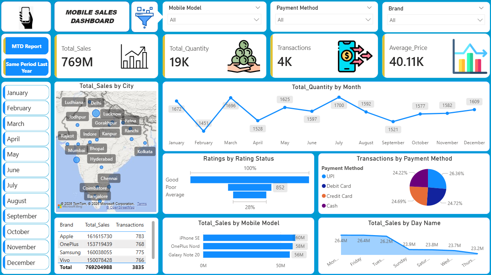
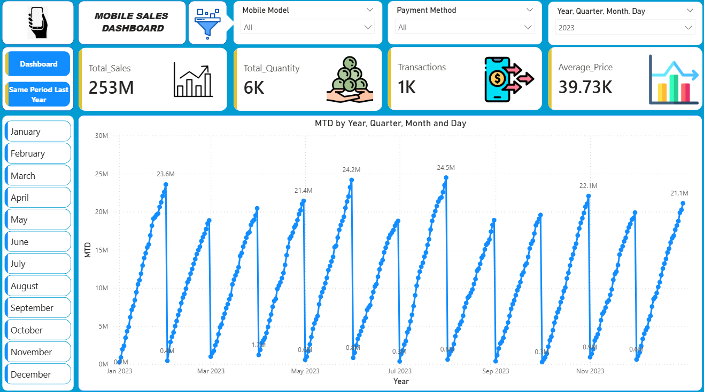
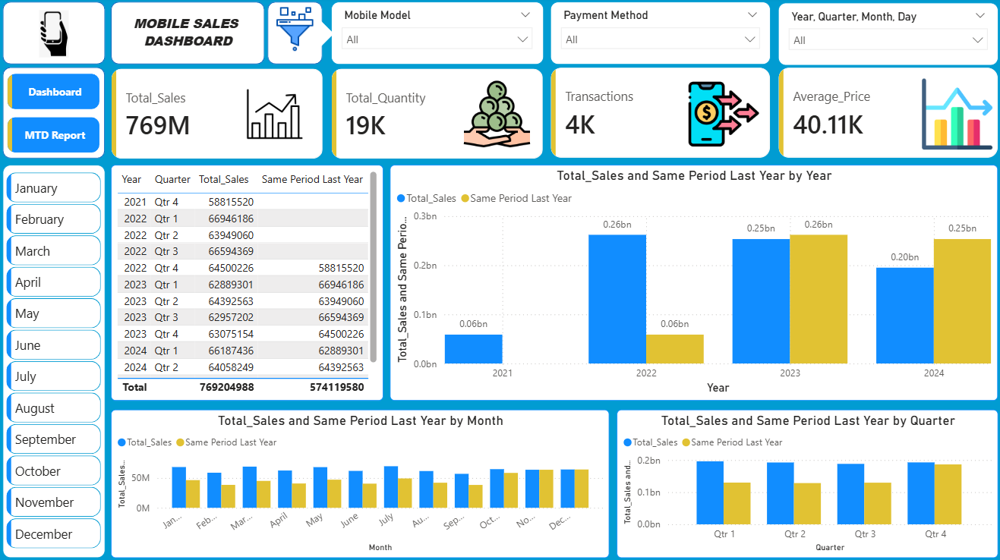

# 📊 Task 2: Data Visualization and Storytelling | Mobile Sales Analysis Dashboard

## 🎯 Task Objective

This project was developed as part of a Data Analyst Internship Task focused on Data Visualization and Storytelling using Power BI.

The goal was to create meaningful visualizations that transform raw sales data into actionable business insights. Through interactive dashboards, KPI tracking, trend analysis, and business recommendations, the project demonstrates how data storytelling can support informed business decisions.

---

## 🎯 Project Objectives

- Analyze overall sales performance and key business KPIs.
- Identify top-performing brands and mobile models.
- Understand city-wise sales distribution and market trends.
- Analyze customer payment preferences.
- Monitor Month-to-Date (MTD) performance.
- Compare current sales with Same Period Last Year (SPLY).
- Generate actionable insights to support business decision-making.

---

## 🛠 Tools & Technologies Used

- Power BI
- Microsoft Excel
- Power Query
- DAX (Data Analysis Expressions)
- Data Modeling
- Data Visualization

---

## 📂 Dataset Information

| Metric | Value |
|----------|----------|
| Total Revenue | ₹769M |
| Total Quantity Sold | 19K Units |
| Total Transactions | 4K |
| Average Selling Price | ₹40.11K |
| Analysis Period | 2021 – 2024 |

### Key Attributes

- Transaction ID
- Date
- City
- Brand
- Mobile Model
- Quantity Sold
- Unit Price
- Total Sales
- Payment Method
- Customer Rating

---

## 📸 Dashboard Screenshots

### Main Dashboard



---

### Month-to-Date (MTD) Report



---

### Same Period Last Year (SPLY) Analysis



---

## 📊 KPI Summary

| KPI | Value |
|---------|---------|
| Total Sales | ₹769M |
| Total Quantity Sold | 19K |
| Transactions | 4K |
| Average Selling Price | ₹40.11K |

### Key Insights

- Generated ₹769M in total sales revenue.
- Sold over 19K mobile units across 4K transactions.
- Strong demand for mid-range and premium smartphones.
- Maintained an average selling price of ₹40.11K per device.
- Indicates stable sales performance and healthy business growth.

---

## 📈 Monthly Sales Trend Analysis

### Highlights

- July recorded the highest sales volume (1,700 units).
- February recorded the lowest sales volume (1,451 units).
- Sales remained stable between 1,451 and 1,700 units throughout the year.
- Strong sales performance was observed in January, March, and July.

### Business Impact

- Helps optimize inventory planning.
- Identifies seasonal demand patterns.
- Supports promotional campaign planning.

---

## 🏙️ City-wise & Brand-wise Analysis

### Top Revenue-Contributing Cities

- Delhi
- Mumbai
- Bangalore
- Hyderabad
- Lucknow

### Top Revenue-Generating Brands

| Brand | Revenue |
|---------|---------|
| Apple | ₹161.62M |
| Samsung | ₹160.04M |
| OnePlus | ₹153.72M |
| Vivo | ₹150.08M |

### Insights

- Metropolitan cities drive the majority of sales.
- Apple generated the highest revenue among all brands.
- Revenue contribution is balanced across leading brands.
- Strong market presence across multiple regions.

---

## 📱 Mobile Model Analysis

### Top Performing Models

| Mobile Model | Revenue |
|---------------|-----------|
| iPhone SE | ₹60M |
| OnePlus Nord | ₹58M |
| Galaxy Note 20 | ₹56M |

### Insights

- iPhone SE generated the highest revenue.
- Premium smartphones contribute significantly to total sales.
- A small group of flagship models drives overall revenue performance.

---

## 💳 Payment Method Analysis

### Transaction Distribution

| Payment Method | Share |
|----------------|--------|
| UPI | 26.36% |
| Debit Card | 24.72% |
| Credit Card | 24.69% |
| Cash | 24.22% |

### Insights

- UPI emerged as the most preferred payment method.
- Digital payments account for nearly 75% of transactions.
- Customers increasingly prefer cashless payment options.

---

## ⭐ Customer Rating Analysis

### Insights

- Most customers provided positive ratings.
- Good ratings significantly outnumber average and poor ratings.
- High customer satisfaction supports repeat purchases and loyalty.
- Low poor-rating counts indicate effective product quality and service.

---

## 📅 Weekday Sales Analysis

### Top Performing Days

| Day | Revenue |
|------|---------|
| Monday | ₹26.4M |
| Friday | ₹26.4M |
| Tuesday | ₹26.2M |

### Lowest Performing Day

| Day | Revenue |
|------|---------|
| Thursday | ₹23.2M |

### Insights

- Monday and Friday recorded the highest sales.
- Sales remained relatively stable throughout the week.
- Customers tend to purchase more at the beginning and end of the workweek.

---

## 📈 Month-to-Date (MTD) Analysis

### Highlights

| Month | Peak MTD Sales |
|---------|---------------|
| January | ₹23.6M |
| May | ₹21.4M |
| June | ₹24.2M |
| July | ₹24.5M |
| November | ₹22.1M |
| December | ₹21.1M |

### Insights

- Consistent month-over-month sales growth.
- Several months exceeded ₹20M in cumulative sales.
- Strong demand and predictable sales patterns support forecasting.

---

## 📊 Same Period Last Year (SPLY) Analysis

### Key Insights

- 2022 recorded significant growth compared to 2021.
- 2023 maintained stable sales performance.
- 2024 showed a decline compared to SPLY.
- Q4 emerged as the strongest-performing quarter.
- January, March, May, and July outperformed their SPLY benchmarks.

### Business Value

- Enables year-over-year performance evaluation.
- Supports forecasting and strategic planning.
- Identifies growth opportunities and improvement areas.

---

## 🎯 Key Findings

- Generated ₹769M in total revenue.
- Sold 19K mobile units through 4K transactions.
- July emerged as the strongest sales month.
- Apple generated the highest brand revenue.
- iPhone SE was the top-performing mobile model.
- UPI was the most preferred payment method.
- Metropolitan cities contributed the highest revenue.
- Customer ratings indicated strong overall satisfaction.

---

## 💡 Business Recommendations

- Maintain inventory for top-selling brands and models.
- Increase marketing investments in high-performing cities.
- Expand UPI-based cashback and promotional programs.
- Launch targeted campaigns during low-performing periods.
- Leverage MTD and SPLY insights for forecasting and planning.
- Replicate strategies from peak-performing months.

---

## 📖 Data Storytelling Summary

The dashboard tells the complete story of mobile sales performance by answering key business questions:

- How is the business performing overall?
- Which cities contribute the most revenue?
- Which brands and mobile models drive sales?
- How do customers prefer to make payments?
- How satisfied are customers with their purchases?
- How is current performance compared to previous periods?

The visualizations help stakeholders quickly identify trends, opportunities, and areas for improvement, enabling data-driven decision-making.

---

## 📌 Conclusion

This project demonstrates the power of data visualization and storytelling in transforming raw sales data into meaningful business insights. Using Power BI, various KPIs, trends, customer behaviors, and product performances were analyzed to uncover actionable recommendations.

The dashboard effectively communicates the business story through clear visualizations, helping stakeholders understand performance patterns and make informed strategic decisions.

---

## 📁 Project Structure

```text
Mobile-Sales-Dashboard/
│
├── Screenshots/
│   ├── Dashboard.png
│   ├── MTD_Report.png
│   ├── SamePeriodLastYear.png
│   ├── Average.png
│   ├── Average 2.png
│   ├── Quantity.png
│   ├── Transactions.png
│   ├── Filter.png
│   └── mainlogo.png
│
├── Mobile Sales Dashboard.pptx
├── Mobile Sales Data.xlsx
├── Mobile_Sales_Dashboard.pbix
└── README.md
```

---

## 👨‍💻 Author

**Abhishek Savita**

📧 asavita3012@gmail.com

💼 LinkedIn: https://linkedin.com/in/abhishek-savita-b41961276

🐙 GitHub: https://github.com/Abhishek-Savita-3012
